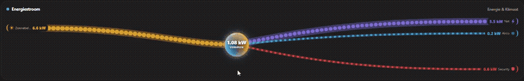

# EMS Manager Binding

A complete **Energy Management System (EMS)** for a home or building, running inside openHAB.

Instead of only visualizing energy, this binding *acts*: a priority-ordered controller scheduler reads your live energy items every few seconds and drives your boiler, heat pump, EV chargers and battery to maximize solar self-consumption, shave grid peaks, follow dynamic tariffs, and respect your breaker limits — while a rich analytics layer tracks cost, CO₂, self-sufficiency and anomalies, and produces battery-sizing and tariff-comparison advice.

It is **vendor-agnostic**: it does not talk to hardware directly. You point it at the openHAB Items you already have (from KNX, Modbus, an inverter binding, Shelly, OCPP, …) and it reads/writes those. Every source and actuator item name is configurable.

> **Safety first.** The bridge starts in **shadow mode** (`shadowMode=true`): controllers compute and log their decisions but write nothing. Verify the decisions in the log, then set `shadowMode=false` to go live. The bridge flag (plus per-controller flags) is the master kill switch.

## Features

- **Priority controller scheduler** — 19 controllers from a hard safety breaker down to read-only observers; higher priority wins on conflict.
- **Solar self-consumption** — routes surplus to boiler / battery / EVs before exporting.
- **Peak shaving** — soft (sticky EWMA band), hard (multi-tier progressive shedding), and a configurable demand/capacity-tariff controller.
- **EV charging** — multi-car coordinator with breaker-aware current sharing, plus a departure/target planner (now / cheapest / solar-first).
- **Battery** — time-of-use dispatcher with `auto` / `fixed` / `readonly` control modes.
- **Heat pump / reversible AC** — SCOP-aware optimizer that **heats or cools** (auto-following the unit's mode item across seasons) with an online-learned RC thermal model and a dynamic-programming pre-condition planner.
- **Pluggable providers** — tariff (flat / day-night / time-of-use / dynamic spot: ENTSO-E, Tibber, aWATTar, CSV), solar forecast (Forecast.Solar), emissions (fixed factors / Electricity Maps).
- **Analytics** — cost / savings / feed-in earnings, self-consumption / feed-in / supply, CO₂, per-device attribution, median±MAD anomaly detection, battery-sizing payback simulation, supplier tariff comparison.
- **Long-term statistics tier** — writes one clean datapoint per day so month/year charts stay fast.

## Supported Things

| Thing | Kind | Purpose |
|---|---|---|
| `bridge` | Bridge | The EMS engine. Reads your energy items, runs the scheduler, writes setpoints. |
| `forecast-solar` | Thing | Solar production forecast (Forecast.Solar free tier; pluggable). |
| `tariff` | Thing | Electricity price provider (flat / day-night / ToU / dynamic spot). |
| `device-meter` | Thing | One per sub-metered load — feeds the per-device breakdown + anomaly detection. |
| `heatpump` | Thing | Heat-pump optimizer (SCOP + thermal model + pre-heat planner). |
| `charger` | Thing | One per EV charger, mapping its control/status items. |

There is no automatic discovery — an EMS must be told which of your items mean "grid", "solar", etc. Create the Things manually (`.things` file or MainUI) and map your items through the bridge configuration.

## Prerequisites

- openHAB 5.x, Java 21.
- A **persistence service** (InfluxDB recommended) — required for analytics, battery sizing, tariff comparison and the statistics tier. Persist your power items on `everyChange,everyMinute` and the binding's `EMS_*` items as shown in [`examples/`](examples/).
- `Number` items for at least: grid power, solar power, house load, battery power, battery SoC.

## Conventions and assumptions (read this)

These are the main portability gotchas; everything else is item-name configuration.

- **Grid sign:** the binding assumes the grid item is **`+ = export`, `− = import`**. If your inverter binding uses the opposite (e.g. Fronius `+ = import`), publish a negated mirror item and point `gridLoadItem` at it.
- **Battery sign:** `+ = charging`.
- **Units:** power items are watts (W). `device-meter` Things have a `powerInKw` flag for clamps that report kW.

## Bridge configuration

All parameters are documented in `thing-types.xml`; the important groups:

**Source items** (point at YOUR items): `gridLoadItem`, `solarLoadItem`, `houseLoadSumItem`, `batteryLoadItem`, `batteryPercentageItem`, `batteryReserveTargetItem`, `boilerStateItem`, `aircoGroupItem`, `weatherCloudinessItem`, `peakShavingEnabledItem`, `boilerUserOverrideItem`.

**EV items** (patterns, `%d` = car number): `carModeItemPattern`, `carCableItemPattern`, `carStatusItemPattern`, `carCurrentLimitItemPattern`, `carPauseItemPattern`, `carChargingItemPattern`, `carPowerOcppItemPattern`, `carAmpsL1/2/3ItemPattern`, `carCount`.

**Safety / electrical:** `breakerLimitA` (per phase), `gridSafetyMarginW`, `gridEwmaTauSec`, `tickIntervalSeconds`.

**Battery:** `batteryControlMode` (`auto`/`fixed`/`readonly`), `batterySetpointItemName`, `batteryMin/MaxSetpointW`, `batteryFixedSetpointW`.

**Economics:** `injectionPriceEurPerKWh` (price paid for fed-in kWh) + the `tariff` Thing.

**Capacity tariff:** `capacityMinBillableW` (default 2500 — the Belgian *capaciteitstarief* floor; set to your market, or ignore the controller).

**ECO protection:** `evEcoSacrosanct` (default `false`). When `true`, the capacity-tariff and hard peak-shaving controllers never pause an EV in ECO mode — they shed the boiler and air-conditioning instead. The hardware breaker-headroom limit still applies. Use it when ECO means "always charging — minimal floor, ramp with solar" and a paused car would look broken to users.

**DHW planner:** `boilerDailyTargetKwh` (0 disables), `boilerReadyByHour`, `boilerRatedKw`, `boilerPowerItem`, `boilerPlanShadow` — guarantee a daily hot-water energy target by a "ready by" hour: solar-first during the day, topping up the remaining gap at the cheapest spot hours overnight (flat tariff → heats just before the deadline). Point `boilerPowerItem` at the boiler's power meter and delivered energy is measured directly (rating-independent) rather than estimated from `boilerRatedKw` × on-time; the running total and target window persist to items, so a restart mid-window resumes instead of re-heating from zero. `boilerPlanShadow` logs decisions without acting.

**CO₂:** `gridCo2GramsPerKWh`, `injectionCo2OffsetGramsPerKWh`, `emissionsProvider` (`fixed`/`electricitymaps`), `electricityMapsApiKey`, `electricityMapsZone`.

**Forecast location:** `latitude`, `longitude` (OpenMeteo temperature forecast for the heat-pump planner; no API key).

**Flags:** `shadowMode` (master kill, default `true`), `statisticsRollupEnabled` (default `true`), `publishLegacyMirrorItems` (default `false` — emits legacy back-compat items for an older rule set; leave off unless migrating).

### Bridge channels (selection)

`gridLoadRawW`, `gridLoadSmoothedW`, `solarLoadW`, `houseLoadSumW`, `batteryLoadW`, `batterySoC`, `batteryReserveTargetPct`, `batteryBelowReserve`, `availableExcessW`, `energyMode` (`SOLAR_EXCESS`/`BALANCED`/`GRID_IMPORT`/`BATTERY_DEPLETING`/`UNKNOWN`), `softPeakShavingEcoCapA`, `breakerHeadroomA`, `lastDecisionLog`, `hardPeakShavingLevel`/`hardPeakShavingStatus`/`hardPeakShavingDetail`, `car1Reason`…`car4Reason` (per-car decision reason — which controller is steering each car and why), `gridLoad5minAvgW`, `surplusOnThresholdW`, `capMonthlyPeakW`/`capCurrentQuarterW`/`capProjectedQuarterW`/`capWouldExceed`/`capStatus`, `optPlanCsv`/`optNextChargeHour`/`optNextDischargeHour`, `controllerCount`/`lastTickAt`/`tickCount`.

## The controller stack

Run order (lowest priority first; later controllers can defer to earlier ones). Every controller honors `shadowMode`.

| Prio | Controller | Role |
|---|---|---|
| 10 | SafetyBreaker | Per-phase breaker headroom; pauses loads that would trip it. |
| 30 | CapacityTariffShaving | Keeps the billed quarter-hour demand peak under budget. |
| 40 | HardPeakShaving | Multi-tier progressive shedding on sustained grid spikes (cars → boiler → aircon). |
| 50 | SoftPeakShaving | Sticky EWMA band that caps EV current early. |
| 60 | EvCoordinator | Multi-car breaker-aware current sharing + auto start. |
| 65 | EvChargingPlan | Departure/target planner (now / cheapest / solar-first). |
| 67 | BoilerPlan | Deadline-aware DHW: solar-first by day, cheapest-hour grid top-up overnight to hit a daily energy target. |
| 70 | SolarSurplusDispatcher | Routes surplus to the boiler. |
| 80 | BatteryTouDispatcher | Time-of-use battery charge/discharge (gated by control mode). |
| 85 | HeatPumpOptimizer | SCOP + thermal-model pre-condition planning; reversible (heat & cool, auto-detected from the unit's mode). |
| 90 | SelfConsumptionOptimizer | 24 h cheap/expensive-hour plan. |
| 100 | ProductionShavingDispatcher | Anti-curtailment dump load. |
| 110 | CostAnalytics | Cost / savings / earnings + kWh accounting (observer). |
| 115 | LongTermStats | Yesterday/week/month/year rollups (observer). |
| 117 | Co2Tracking | CO₂ emitted / avoided (observer). |
| 118 | AnomalyDetection | Per-device median±MAD outlier flagging (observer). |
| 119 | StatisticsRollup | One clean datapoint/day for fast long-range charts (observer). |

### Asset handlers (dispatch targets)

Controllers emit `SetpointRequest`s; the bridge routes each to an asset handler that owns dedupe + write gating: **boiler** (`boilerStateItem`), **airco-group** (`aircoGroupItem`), **car1..N** (the `car*ItemPattern` items), **battery** (`batterySetpointItemName`, mode-gated).

## `tariff` Thing

`kind=flat` (`flatPriceEurPerKWh`), `kind=day-night` (`dayPriceEurPerKWh`, `nightPriceEurPerKWh`, `dayStartHour`, `dayEndHour` — may wrap midnight), `kind=tou-schedule` (`hourlyPricesCsv` — 24 comma-separated prices), or `kind=dynamic-spot` (`subProvider` = ENTSO-E / Tibber / aWATTar / CSV, with `apiKey`/`csvUrl`/`markupEurPerKWh`). Channels: `nowPriceEurPerKWh`, `next1hPriceEurPerKWh`, `todayMin/Max/AvgPrice`, `cheapestHourStart`, `mostExpensiveHourStart`, `schedule24hCsv`, `schedule48hCsv`.

## `forecast-solar` Thing

`lat`, `lon` (required), `declination` (roof tilt 0–90), `azimuth` (0=south, 90=west, −90=east), `kwp`, `refreshIntervalMin` (≥70 keeps you under the free-tier 12-calls/hour limit). Snapshot is file-cached so restarts don't burn API calls. Channels: `nowW`, `next1hWh`/`next3hWh`/`next6hWh`, `todayKwh`, `tomorrowKwh`, `peakTodayAt`, `lastRefreshAt`, `rateLimitRemaining`, `lastError`.

## `device-meter` Thing

One per sub-metered load. Config: `powerItem` (or `energyItem`), `powerInKw`, `category`, `color`. Feeds the per-device kWh breakdown and the anomaly detector. The bridge aggregates tracked vs untracked load on `dmTrackedW`/`dmUntrackedW`/`dmTrackedKwhDay`.

## `heatpump` Thing

Config: `currentTempItem`, `targetTempItem`, `scopCop`. The optimizer learns an RC thermal model online and runs a DP planner to pre-heat in the cheapest hours. Outputs a recommended mode, the next pre-heat window, model R/C/RMSE and a 24 h plan cost.

## `charger` Thing

One per EV. Config: `carKey`, and the per-charger item names (`modeItem`, `cableItem`, `statusItem`, `currentLimitItem`, `pauseItem`, `chargingItem`, `powerOcppItem` / `powerTagKwItem`, `ampsL1/2/3Item`).

## Examples & architecture

[`examples/`](examples/) contains a complete `demo.things` + `demo.items` for a SolarEdge-class inverter + battery + two EV chargers + a heat pump, plus the recommended persistence strategies. The internal design (the tick loop, `EnergyContext`, controller contract, asset handlers, the statistics tier) is in [`doc/ARCHITECTURE.md`](doc/ARCHITECTURE.md), and the device-capability abstraction (the layer that normalizes item names + sign conventions) in [`doc/CAPABILITIES.md`](doc/CAPABILITIES.md).

## Dashboards & widgets

Two ready-made MainUI front-ends ship with this repo:

### EMS Energy Cockpit — [`examples/ems-energy-page/`](examples/ems-energy-page/)

A 7-tab `oh-tabs-page` dashboard (Overview · Devices · EV · Analysis · Capacity · Compare · Control) that renders the binding's `EMS_*` analytics end-to-end: a gradient Sankey distribution, four self-sufficiency gauges, a per-device breakdown with anomaly flags, EV charging cards, cost / CO₂ / battery-sizing / tariff analytics, the Belgian capacity tariff, comparison charts, and the controller + peak-shaving control panel. Paste-in pages + widgets; full walkthrough and per-tab screenshots in its [README](examples/ems-energy-page/README.md).


### Energy Flow widget — [`widgets/energy_flow/`](widgets/energy_flow/)

A standalone animated Sankey power-flow widget: solar/generators feed a glowing centre hub, grid and battery swap sides depending on import/export, and consumers fan out on auto-compacting lanes. Theme-adaptive, flat, dependency-free and fully configurable — it works with any `Number:Power` items, not just this binding. See its [README](widgets/energy_flow/README.md).



## Known limitations (honest)

- **One reference installation** has been exercised end-to-end; other setups may surface convention/unit edge cases — start in shadow mode.
- **No device-capability auto-discovery** — items are mapped by hand.
- **Capacity-tariff** logic models the Belgian *capaciteitstarief* (configurable floor; the quarter-hour-peak concept is region-specific).
- **The statistics tier** is a binding-side workaround for openHAB lacking server-side persistence aggregation; long-range charts depend on it.
- **Battery `auto` mode** needs an inverter that exposes a writable setpoint item; `readonly`/`fixed` always work.

## Building from source

Like all openHAB add-ons, this bundle builds **inside an `openhab-addons`
checkout** (the parent reactor provides the formatter, static-analysis
rulesets and bundle tooling — it does not build standalone). Copy this repo's
contents into a clone of [`openhab-addons`](https://github.com/openhab/openhab-addons)
as `bundles/org.openhab.binding.emsmanager/`, then:

```
cd openhab-addons/bundles/org.openhab.binding.emsmanager
JAVA_HOME=/path/to/jdk-21 mvn clean install
```

This runs the full pipeline (compile, Spotless, Checkstyle/PMD/SpotBugs,
null-analysis, unit tests). The resulting `target/*.jar` drops into
`<openhab>/addons/`.

## License

EPL-2.0 (matches the openHAB Add-ons project).
