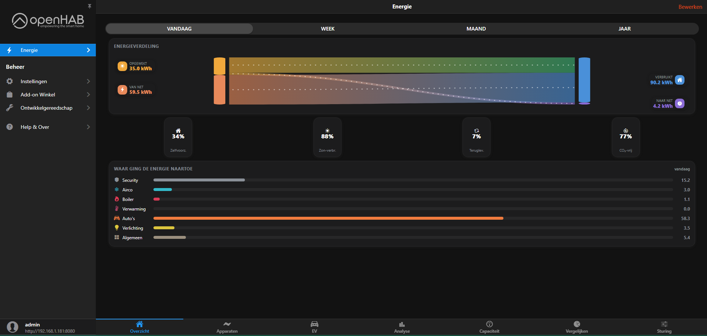
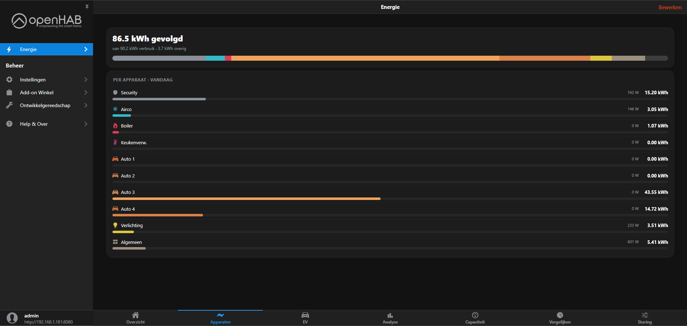
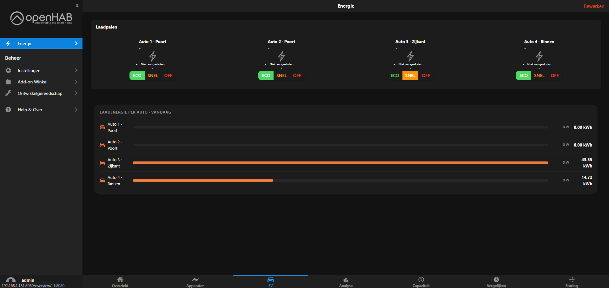
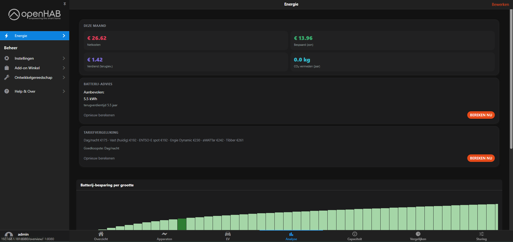
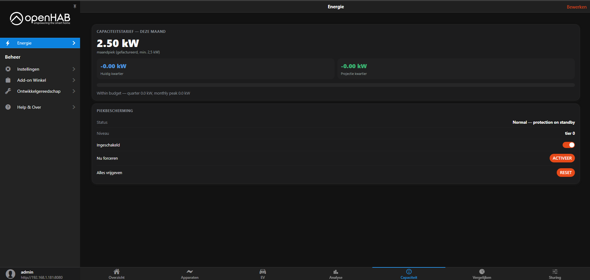
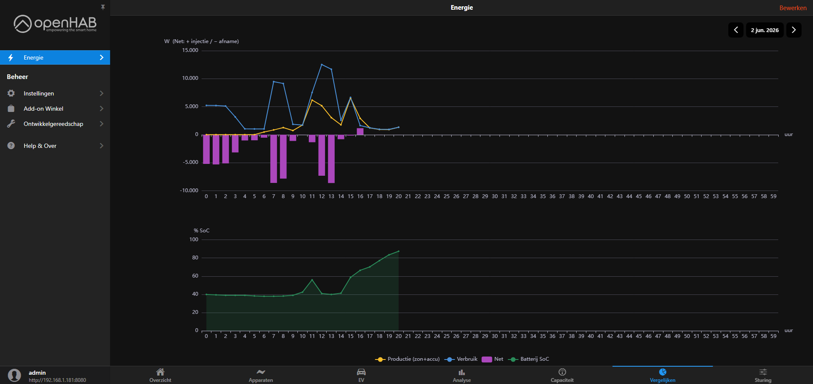
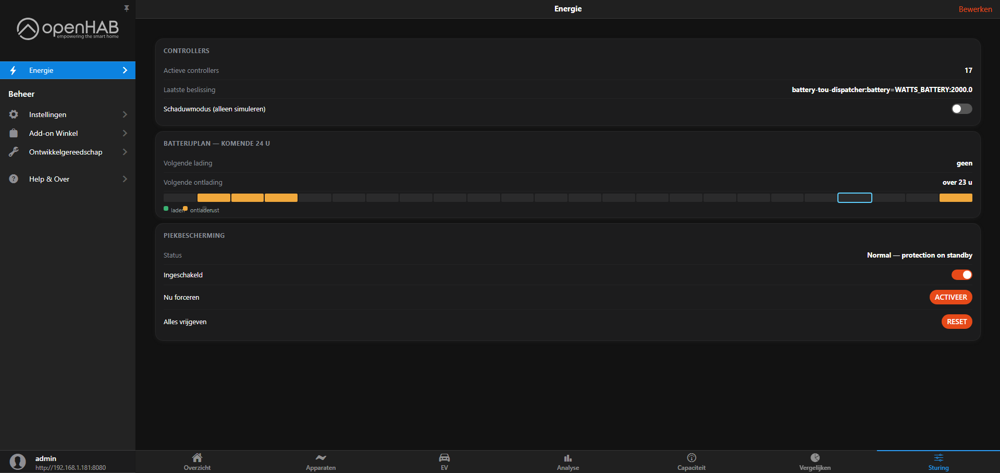

# EMS Energy Cockpit

A single-page MainUI dashboard for openHAB that consolidates everything about your building's energy into one place: live energy flow, daily distribution, per-device consumption, EV charging, cost & battery analytics, Belgian capacity tariff, comparison charts, and control panels. It's a 7-tab `oh-tabs-page` (uid `ems`, titled **Energie**) that serves as the companion dashboard for the openHAB **emsmanager** binding, rendering the items that binding (and the surrounding rules) publish.

## Screenshots

> The page ships without images — add your own under `./img/`.

## Tabs

### Overzicht

Energy distribution and device breakdown dashboard showing Sankey flow, self-sufficiency metrics, and per-device consumption with a period selector.

- Period selector (Vandaag, Week, Maand, Jaar) for daily, weekly, monthly, and yearly views.
- **Energieverdeling** Sankey diagram of flows — solar generated, grid supply, and consumption — with animated flow indicators (solar→home, solar→grid, grid→home).
- Four gauge cards: **Zelfvoorz.** (self-sufficiency %), **Zon-verbr.** (solar consumed %), **Teruglev.** (grid feed-in %), **CO₂-vrij** (CO2-free %, with a 65% weighting on grid supply for renewable grid energy).
- **Waar ging de energie naartoe** — stacked horizontal bars for 7 device categories: Security, Airco, Boiler, Verwarming, Auto's (4 vehicles), Verlichting, and Algemeen, in kWh proportional to total tracked daily consumption.

### Apparaten

Per-device energy consumption tracking with a stacked daily-share bar, live power draw, daily totals, and anomaly flags.

- Anomaly alert banner showing the count of anomalies detected today (when present).
- Summary card with total tracked kWh for the day, consumption breakdown, and a stacked percentage bar across all 10 devices.
- **Per apparaat · vandaag** card with a row per device: Security, Airco, Boiler, Keukenverw., Auto 1–4, Verlichting, and Algemeen.
- Each row: icon + name + anomaly warning triangle (red, when active) + live power (W) + daily total (kWh) + a progress bar showing that device's share of daily consumption.

### EV

Electric-vehicle charging status and daily energy consumption for up to four connected vehicles, with per-car mode controls (ECO/SNEL/OFF).

- Charging-state card with 4 ports showing connection and charging status icons (cable connected, charging, idle, disconnected) plus ECO/SNEL/OFF mode buttons per car.
- EMS reason display (paused or peak-shaving) shown in orange italic below the status when applicable.
- Daily energy meter with per-car kWh consumption and live charging power (W).
- Relative bar chart normalized to the highest car's kWh value to compare usage across vehicles.

### Analyse

Monthly cost & CO2 summary, battery-sizing optimization advice with a sweep chart, and tariff comparison ranking.

- Cost tiles: monthly grid costs (Netkosten), solar savings (Bespaard), feed-in earnings (Verdiend), and CO2 avoided annually (CO₂ vermeden).
- Battery sizing advice: recommended capacity (kWh) with payback period (years), plus a "Calculate now" button to recompute.
- Battery savings sweep chart: annual savings (EUR) across battery sizes 0–30 kWh, optimal size highlighted.
- Tariff comparison ranking: providers ranked by annual cost (EUR), cheapest highlighted in green.

### Capaciteit

The monthly capacity tariff (Belgian peak management) with quarter-hour running peak, projection, and peak-shaving controls.

- **Capaciteitstarief — deze maand**: monthly peak in kW (minimum 2.5 kW); tiles for the current and projected quarter-hour peak (green within limits, red when exceeding); a progress bar of projection vs. the monthly limit; and a capacity-budget status line.
- **Piekbescherming**: protection status and current tier level; a toggle to enable/disable peak-shaving; an Activeer button to engage it manually; and a Reset button to release all measures.

### Vergelijken

Time-series comparison of production, consumption, grid exchange, and battery state across selectable periods.

- Upper chart: Production (solar+battery), Consumption (house), and Grid exchange (positive = injectie, negative = afname) as hourly trends/bars.
- Lower chart: Battery SoC % as an hourly trend line with shaded area.
- Interactive legend, axis labels (W / %), hover tooltips, an inside-zoom slider, and a day/week/month/year period selector in the header.

### Sturing

Control panel for EMS battery optimization, peak-shaving, and active-controller status.

- Controllers card: active controller count and the timestamp of the last optimization decision.
- Shadow-mode toggle: simulation-only mode (decisions not executed).
- Battery plan card: a 24-hour timeline of planned charge (green), discharge (orange), and idle (gray) periods, plus time-to-next charge and discharge events.
- Peak-shaving card: status display, enable/disable toggle, manual engage button, and reset button.

## Requirements

- The openHAB **emsmanager** binding (publishes the `EMS_*` analytics and the EMS reason/optimizer items).
- **EMS analytics items** — `EMS_SelfConsumption_*`, `EMS_FeedIn_*`, `EMS_Supply_*`, `EMS_Cost_EUR_*`, `EMS_Savings_EUR_*`, `EMS_Earnings_EUR_*`, `EMS_CO2_*`, `EMS_BatterySizing_*`, `EMS_TariffComparison_*`, `EMS_Capacity_*`, `EMS_Anomaly_*`, `EMS_Bridge_*`, `EMS_Optimizer_*`.
- **EMS device meters** — `EMS_DM_<device>_kWh` and `EMS_DM_<device>_W` for Security, Airco, Boiler, HeaterKitchen, Car1–4, Light1–3, General, plus `EMS_DeviceMeter_Tracked_kWh_Day`.
- **Plant telemetry** — `Solar_load`, `Grid_load` (+ = export), `House_load_sum`, `Battery_percentage` (and related `Battery_*`).
- **EV / OCPP items** — `Car{1..4}_{Status,CableConnected,Laadstatus,EMS_Reason,Mode}_OCPP`.
- **Peak-shaving items** — `PeakShaving_{Status,Level,Enabled,Manual_Engage,Manual_Reset}`.
- A persistence service (InfluxDB) feeding the Vergelijken charts (`Solar_load`, `House_load_sum`, `Grid_load`, `Battery_percentage`).

## Install

These are MainUI pages and widgets, not bindings — there's nothing to compile.

1. In openHAB go to **Settings → Pages**, create a new page, switch to the **Code** tab, and paste the YAML from `./pages/ems.yaml`. This is the entry page (uid `ems`).
2. In **Settings → Widgets**, for each file under `./widgets/`, create a new widget, switch to **Code**, and paste its YAML.
3. Add the `ems` page to your sidebar so **Energie** appears in the main menu.

> This is a **site-specific** dashboard: labels are in Dutch and the YAML references this installation's exact item names. To reuse it elsewhere, adapt the item names (and translate the labels) to match your setup.

## Notes

- The entire UI is in **Dutch** (labels, tab names, mode buttons).
- The **period selector** (Vandaag/Week/Maand/Jaar) drives the Overzicht tab via a `vars.period` variable; Vergelijken has its own header period selector.
- The **device breakdown is daily-only** — the per-device kWh/W rows and stacked bars reflect today's tracked consumption, regardless of the Overzicht period selector.
- This page is **tightly coupled to the emsmanager binding** and the item naming above; missing items render as blank tiles or `-`.
- Vergelijken reads from persistence (InfluxDB) — without history those charts render empty.
- The capacity tab assumes **Belgian capacity-tariff** rules (2.5 kW minimum, quarter-hour running peak).
