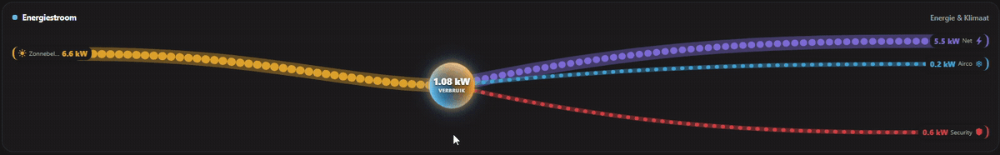

# Energy Flow — MainUI widget

An animated **Sankey power-flow** widget for openHAB MainUI. Solar/generators feed
a glowing centre hub, **grid and battery dynamically swap sides** depending on
whether they're feeding in or drawing out, and an **unlimited** set of consumers
fan out on the right. Flat design, **light & dark** adaptive, fully configurable,
**no external dependencies** (pure YAML + inline CSS/SVG).



## Features

- **Animated marching-dot flows** — only flows that are actually active are shown; they fade in/out with usage.
- **Dynamic source/sink** — grid sits on the **left when importing**, **right when exporting**; battery **left when discharging**, **right when charging**. No backwards lines.
- **Unlimited consumers & generators** via openHAB **Group** items — drop an item into the group and it appears automatically, with an **auto-assigned distinct colour** and a **keyword-matched icon**.
- **Auto-compacting consumer lanes** — only consumers **actually drawing power** take a slot, spaced evenly among **themselves** (idle meters take no space and draw no ribbon), so the flow stays uncluttered on mobile no matter how many consumers you configure.
- **Glowing rotating centre hub** showing total consumption; spin speed scales with throughput.
- **Configurable sign conventions** (grid export ±, battery charge ±) and **W/kW scaling**.
- **Theme-adaptive**, responsive, flat (no glassmorphism), self-contained.

## Requirements

- openHAB 4.x / 5.x MainUI.
- `Number` / `Number:Power` items for: total consumption, grid, (optional) battery, and each source/load.
- **Two Group items** — one for generators, one for consumers — populated with your power items.

## Setup

**1) Create the two groups and add your power items** (textual example; the UI works too):

```java
Group gEnergyFlow_Generators "Generators"
Group gEnergyFlow_Consumers  "Consumers"

// generators (left, inflow)
Number:Power Solar_Power  "Solar [%.0f W]"  (gEnergyFlow_Generators)

// consumers (right, outflow) — add as many as you like
Number:Power Boiler_Power "Boiler [%.0f W]" (gEnergyFlow_Consumers)
Number:Power EV_Power     "EV [%.0f W]"     (gEnergyFlow_Consumers)
Number:Power HVAC_Power   "Air-co [%.0f W]" (gEnergyFlow_Consumers)
```

**2) Add the widget**, then in its config set the generators group, consumers
group, grid item, (optional) battery item and total-consumption item. Check the
**sign toggles** match your meter conventions (see Notes).

## Install

- **Marketplace:** _link once published_ → *Settings → Widgets → Add from Marketplace*.
- **Manual:** open [`energy_flow.yaml`](./energy_flow.yaml), copy all of it, then in
  MainUI go *Settings → Widgets → `+` → Code* and paste it; **Save**.

## Configuration

| Property | Meaning |
|---|---|
| Generators group | Group of generation items (PV/wind/genset) → left inflows |
| Grid power item / Grid label | Grid meter + its short name |
| Battery power item / Battery label | Battery power + its short name |
| Battery SoC % item | Optional. State-of-charge %, shown as a chip and appended to the battery flow |
| Total consumption item / Centre caption | Figure + caption shown in the centre hub |
| Consumers group | Group of load items → right outflows |
| Subtitle | Optional header subtitle shown top-right |
| Source / Consumer divisor | `1000` if items are in **W**, `1` if already in **kW** |
| Grid sign: positive = EXPORT | Flip if your grid meter is positive-on-import |
| Battery sign: positive = CHARGING | Flip if your battery is positive-on-discharge |

## Notes

- **Sign conventions:** defaults are *grid += export* and *battery += charging*; flip the toggles if your meters differ.
- **Icons:** each consumer/generator gets an icon auto-picked from keywords in the item name/label (`car`, `light`, `boiler`, `heat`, `air`, `security`, `pump`, `wash`, `oven`, `solar`, `wind`, …), otherwise a neutral default. Colours are auto-assigned and distinct.
- **Layout:** consumers auto-compact — only those drawing power occupy a slot, spaced evenly among themselves, so the right side stays clean on mobile even with many configured. Generators pack tighter beyond ~8 per side.
- Grid & battery are intentionally single, bidirectional flows; only generators and consumers are unlimited.

## License

[EPL-2.0](../../LICENSE), matching the repository.
